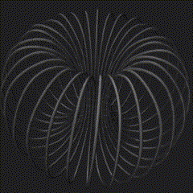
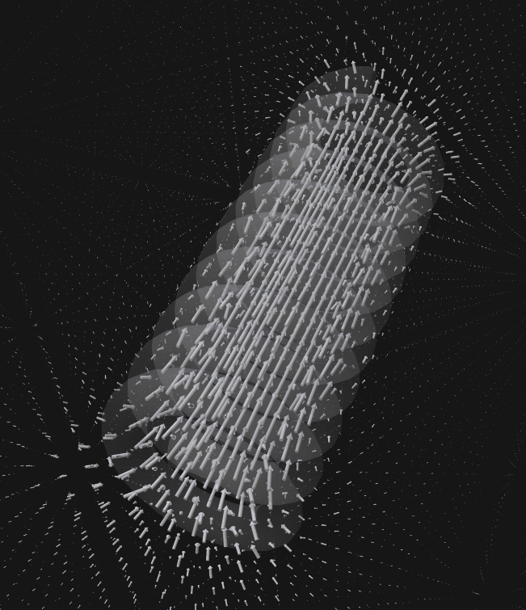
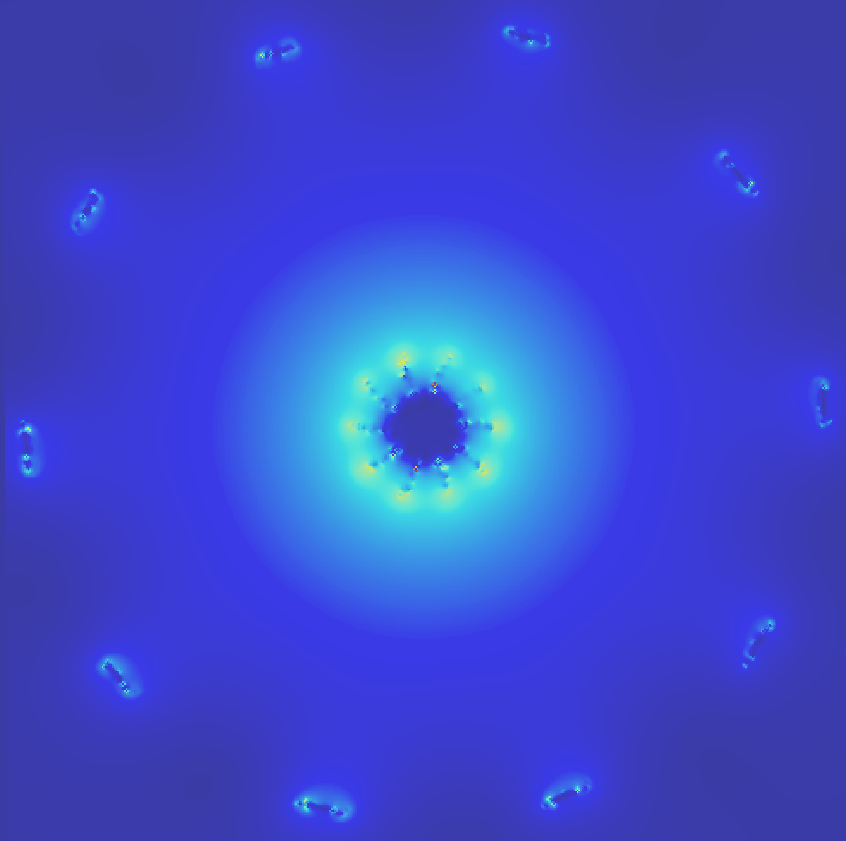
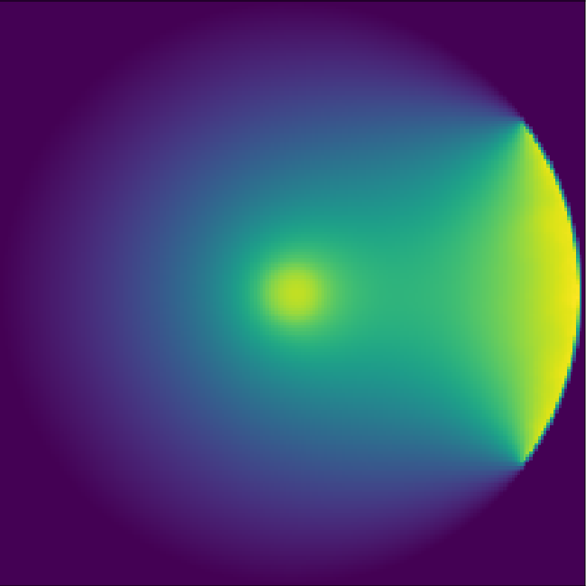

# Walk On Spheres

Walkonspheres is a package for solving Poisson's equation with no boundary term :

$$ \Delta A = f \quad \in \Omega$$

$$ A = 0 \qquad \quad \in \partial \Omega$$

with $f$ the source term inside the domain $\Omega$, with $\partial \Omega$ it's boundary.

This equation can represent magnetostatic problems, electrostatics, heat... Usually these problems have a structure that radiates a energy. The package is meant to take into account any type of geometry as the source of radiation, with an interface described below.

The package uses pybind11 C++ interface with python, NVIDIA's Warp library to write CUDA kernels, and polyscope for visualization.

# Exemples
Figures below show vector fields generated by different simulations.

|  |  |
| ------------------------- | ------------------------- |


|  |  |
| ------------------------- | ------------------------- |


# The Walk On Spheres algorithm : intrudction

We use in this package the said *reverse* walk on spheres algorithm (Qi et al.). The main concept is the following : a walk on sphere is a random walk from which the steps are taken on the biggest sphere contained in the domain $\Omega$. An illustration of a walk on sphere :


The walk needs at each step to know the distance from a point and the domain $\Omega$. Since in the problems we solve in this package, the domains $\Omega$ are simply defined by the fact that we want the solution to be zero at infinity (boundary conditions), we set the domain to be a sphere with a radius big enough to represent this infinity. Then to get the distance of a point on the walk from the domain, we simply compute :

$$ distance = R_{\infty} - \sqrt{x^2 + y^2 + z^2} $$

The *reverse* walk on spheres starts walks from the source and propagates it's values, so we have to know where the source is inside the domain. Usually it's represent by a mesh, or some kind of geometry. The algorithm will take a point on that geometry, the source value corresponding, and propagate it's value inside the domain.

This package is meant so we don't have to assume the geometry is represented by a mesh. Indeed, in the algorithm, we only need some source points and values. Those points are to be generated by the user, before the simulation.

Structures representing sources can be quite complex (a network of wires would for example need a high precision mesh, expensive to compute). The only need for points make so that the user don't necessarily have to compute the mesh : if he has an implicit geometry, a CAO geometry, etc... He just have to generate points from that structure, and give the package those points (with the source value associated).

# Inverse Problems
This package is an answer to difficulties encountered in inverse problems on geometry. Finding the right parameters on complex geometry can be costly since we, at each step, need to regenerate the mesh, a step that can take hours for complex structures.

Here we have a pipeline that can solve the direct problem without generating any mesh. This can be used in black box optimization tools.

# Installation
Once you made sure you have CUDA Toolkit and a C++ compiler installed, just go in the folder and write :
```
pip install .
```

# Usage
Once it's installed, the steps are the following (full examples can be seen in the examples folder) :

Load the library
```py
import walkonspheres as ws
```

Create the object holding solver and setup methods
```py
pde = ws.PoissonSolver()
```

Set the parameters (all of them must be set with `pde.set_x(x)` for each parameter) :
- `odim` is the solution dimension (scalar (1) or vector (3) field)
- `sdfR` is the radius of the "infinite" sphere (must be much greater than the fursest point of the structure)
- `nwalks` is the number of information to be gathered, and is closely related to the number of Monte Carlo samples, and so will define the precision of the simulation
- `query_points` is a vector `(N,3)` of `N` 3D coordinates where we want to compute the solution.
- `source_points` is the vector `(M,3)` of pre-sampled points from the source-structure (given by the user)
- `source_values` is the vector containing the values (`(M)` if scalar or `(M,3)` if vector) of the source corresponding to the coordinates defined by `source_points`
- `samplevol` is the volume of the source-structure


  **Note** : the freedom allowed by the walk on spheres algorithm comes in part from the `query_points`. If you want to plot the solution on a grid, then give fill this data structure with a grid. Now if, for example, you only want the solution on a subpart of the structure, you can directly give points from this subpart, and doing that reducing by a fair amount the complexity of the resolution

  **Note** : the number `M` of couples point-values sampled from the source must be greater than the "N Started Walks" value printed at the end of the simulation. `nwalks` will indead define the number of informations gathered during the simulation. But one walk will get an arbitrary number of informations, each starting walk taking a random couple point-value from the one given. The `N Started Walks` at the end gives the number of started walks and such, if it is greater than the number of couples point-values, than we are cycling and inducing a statistical bias.


```py
pde.set_nwalks(10000)
pde.set_sdfR(400.0)
pde.set_solution_dimension(1)
...
```

we provide a tool to get a grid easily :
```py
lower_corner = [-170.0,-170.0,-170.0] # Lower corner grid delimiter
upper_corner = [170.0,170.0,170.0]    # Upper corner grid delimiter
n = 30   # Solution grid dim
query_points = ws.create_grid_query_pts(lower_corner, upper_corner, n)
```

Note that source points can be built by a python function of yours, describing a certain parametrized geometry, or it can come from a file, or other methods you like.
```py
pde.set_source_points(source_points)
```
a tool to initialize those points from a file is also given (each line of the file should contain the 3 coordinates of a point, with ',' delimiters) :
```py
ws.read_pts_from_file("assets/meshpts.dat")
```

The source values, that needs to match the source points, can be sent one of 4 ways :
```py
pde.set_source_value(1.0)
pde.set_source_values(values_array)
pde.set_source_vector([1.0,1.0,1.0])
pde.set_source_vectors(vectors_array)
```
the value keyword corresponds to the 1D (scalar field) case, the vector to vector fields. You can set the same value for every point (singular version), or directly set the array yourself (plural version). You can also create this array by reading a file.

Call this function to get the solution
```py
pde.solve()
```

And finally visualize it (adding a mesh visualization can help understand the situation). We provide some flexible tools to do that :

```py
# Initialize Polyscope with our presets
# polyscope.init() to get the default ones
ws.ps_init()

# Creates a Point Cloud "pcloud" from the query_points
# will visualize the solution A and it's magnitude if it's a vector field
pcloud = pde.plot() 

# Plot rotationnal (if vector field) from a grid of dimensions (nx,ny,nz)
# and steps (dx,dy,dz)
pde.plot_rot(pcloud, nx, ny, nz, dx, dy, dz)

# Add a mesh to the visualization, coming from a STL file
pde.plot_mesh("meshfile.stl")

# Add our default sliceplace
ws.ps_add_sliceplane()

# Or define it yourself
sliceplane = polyscope.add_scene_slice_plane()
sliceplane.set_pose([0,0,0], [0,-1,0]) # from position and direction vectors

# Add other fields/infos
ws.ps_add_3D1(pcloud, field, "Name") # Scalar field
ws.ps_add_3D3(pcloud, field, "Name") # Vector field

# Show the plot
polyscope.show()
```


# Visualization

A couple of useful tips to help the visualization with polyscope :

-  "Polyscope->View->Slice Plances" by unchecking it. You can also display the draw plane and draw widget to move it, or create a new one.
- In the structures part, if it's a vector field, there should be :
  - the `Solution query points`, where the radius will define the size of the squares. For the colors of those to be the magnitude of the computed field, you have to check the "Enabled" box.
  - the `Solution (vector)` where you can change the length and radius of the vectors

# Bibliography
Qi, Yang, Dario Seyb, Benedikt Bitterli, et Wojciech Jarosz. « A Bidirectional Formulation for Walk on Spheres ». Computer Graphics Forum 41, nᵒ 4 (juillet 2022): 51‑62. https://doi.org/10.1111/cgf.14586.